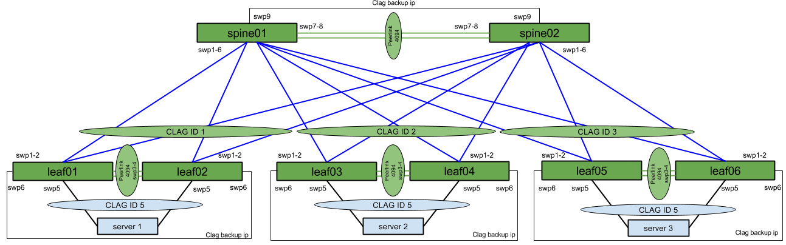

# Cumulus Linux Rolling Upgrade Demo - Layer 2 Example

## Introduction
This demo will show how to use Ansible and Cumulus Linux to execute fully automated rolling upgrades of a layer 2 MLAG network. 

The Vagrantfile used to build the demo network utilizes the latest Cumulus VX image available. If there is a specific VX image you'd like to use, please edit this parameter in the Vagrantfile.
"cumulus_image = "CumulusCommunity/cumulus-vx""

Acronyms CLAG and MLAG may be used interchangably. 

## Network Diagram:
The topology for this demo can be seen here.

[//]: # " Diagram located at: https://docs.google.com/drawings/d/1f7YIGF2dTdaFvvdVucxaEv-kGkqJrdd_Z-Xt38xARDk/edit"

## Connectivity
Each server is using [Multi-Chassis Link Aggregation (MLAG)](https://docs.cumulusnetworks.com/display/DOCS/Multi-Chassis+Link+Aggregation+-+MLAG) to both leaf switches. All leaf switches are using MLAG to the spine layer. 

Each device is using LACP and STP. MLAG peers will be using peerlinks and backup links as to avoid split brain issues.

This topology demonstrates a deployment of [Cumulus Link Aggregation (CLAG)] (http://docs.cumulusnetworks.com/display/DOCS/Multi-Chassis+Link+Aggregation+-+MLAG) and [Cumulus Virtual Router Redundancy (VRR)](http://docs.cumulusnetworks.com/display/DOCS/Virtual+Router+Redundancy+-+VRR).

Details:

CLAGs are formed as pictured above, with CLAG IP keepalive and messaging communication performed using interface peerlink.4094.

CLAG IDs 1-3 are used between the Leaf and Spine switches in order from left (leafs1/2) to right. CLAG ID 5 is configured to the servers to correspond to server port connection numbering. The server's bond interface is named "bond0".

Each switch uses a VLAN-aware bridge, trunking VLANs 1-100 with a native VLAN of 1.
SVIs are configured on VLAN 10 on all switches. The Spine switches also have VRR configured between them in VLAN 10 to provide gateway redundancy for the servers.
The servers are configured with a VLAN 10 address and an address in the native VLAN (not pictured).

IP Connectivity for VLAN 10:
* Server1         		  - 10.1.10.12
* Server2         		  - 10.1.10.34
* Server3         		  - 10.1.10.56
* Default Gateway (VRR) - 10.1.10.254

SVI IP's:
* leaf1  - 10.1.10.1
* leaf2  - 10.1.10.2
* leaf3  - 10.1.10.3
* leaf4  - 10.1.10.4
* leaf5  - 10.1.10.5
* leaf6  - 10.1.10.6
* spine1 - 10.1.10.252
* spine2 - 10.1.10.253

Deployment:

To build the network configuration, run the Ansible playbook with the command "ansible-playbook provision.yml".

## The Backup Process
If you simply want to backup configuration files from the networking devices, from the l2-demo directory, run the configs-backup.yml playbook to backup interesting configuration files to the roles/* directory.

If you run the leaf-upgrade.yml or spine-upgrade.yml playbooks, they will backup the interesting files as well as run through the software upgrade process.

## The Upgrade Process
Each server is connected to two leafs. The leftmost leaf will be considered to be in an "A" group. The rightmost leaf will be considered to be in a "B" group. The upgrade process will be on a datacenter wide basis, meaning all "A" switches will be run in parallel, and the same for all "B" switches. The MLAG/CLAG priority is manipulated prior to upgrade to ensure as little packet loss as possible during the process.

For the spine devices, the same principals will be used.

## Configuration Recovery Process
If you want to restore configuration files to the networking devices, from the l2-demo directory, run the leaf-config-restore.yml or spine-config-restore.yml playbooks to copy the configuration files from the backup location to the networking devices.

## Troubleshooting
There are several troubleshooting playbooks included in this demo. To run the playbooks, simply "ansible-playbook 'insert playbook name here'. Be sure to run these playbooks from the l2-demo directory or direct Ansible to the correct inventory.
