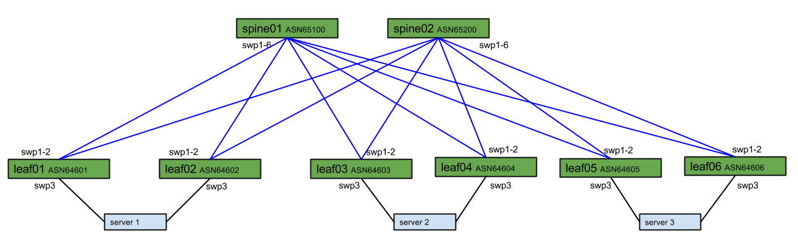

# Cumulus Linux Rolling Upgrade Demo - Layer 3 Example

## Introduction
This demo will show how to use Ansible, Behave and Cumulus Linux to execute fully automated rolling upgrades of a layer 3 network. Traffic will be drained and validated before a switch is upgraded. After the upgrade traffic will be brought back online, validated and the second device will be upgraded. 

## Network Diagram:
The topology for this demo can be seen here.

[//]: # " Diagram located at: https://docs.google.com/drawings/d/1tJb29fmmuxDJkbvayKu68Vxj_D6sQVd71bVuh-17R5E/edit"

## Routing
Each host is running [Cumulus Quagga](https://support.cumulusnetworks.com/hc/en-us/articles/216805858) and using [BGP unnumbered](https://docs.cumulusnetworks.com/display/DOCS/Configuring+Border+Gateway+Protocol+-+BGP#ConfiguringBorderGatewayProtocol-BGP-unnumberedUsingBGPUnnumberedInterfaces) to both leaf switches.

Each host is receiving a default route from both leaf switches. The host will use ECMP routing to load share between both leaf switches. 

Between spines and leafs is eBGP unnumbered. 

## The Upgrade Process
Each server is connected to two leafs. The leftmost leaf will be considered to be in an "A" group. The rightmost leaf will be considered to be in a "B" group. The upgrade process will be on a datacenter wide basis, meaning all "A" switches will be run in parallel, and the same for all "B" switches.

For the spine devices, the same principals will be used, but on a single spine at a time.

### Staging the Upgrade
Before the upgrade is executed, all A devices will use BGP AS Path prepending to force all traffic both from the spines as well as the servers to prefer the B switch. 

A python script, packaged into an Ansible module, will execute on each node and validate that no traffic is flowing through the device before any intrusive changes are made.

### Executing the Change
In this virtual environment the upgrade will be simulated via the `reboot` command. In a production environment a software upgrade would execute in an identical manner.

### Post-Change Validation
When the device comes back online traffic will still route around it, as a result of the previously applied AS Path Prepend. 

Before any additional changes are made, Behave will once again execute tests to verify that the network is in a stable state. 

### Restoring Traffic
After the stability tests have passed the AS Path Prepend will be removed, allowing traffic to utilize both the "A" and "B" switch. 

At this point a final validation will run to verify that traffic is flowing as expected. 

Once the final validation passes the process will repeat for the "B" side switches.